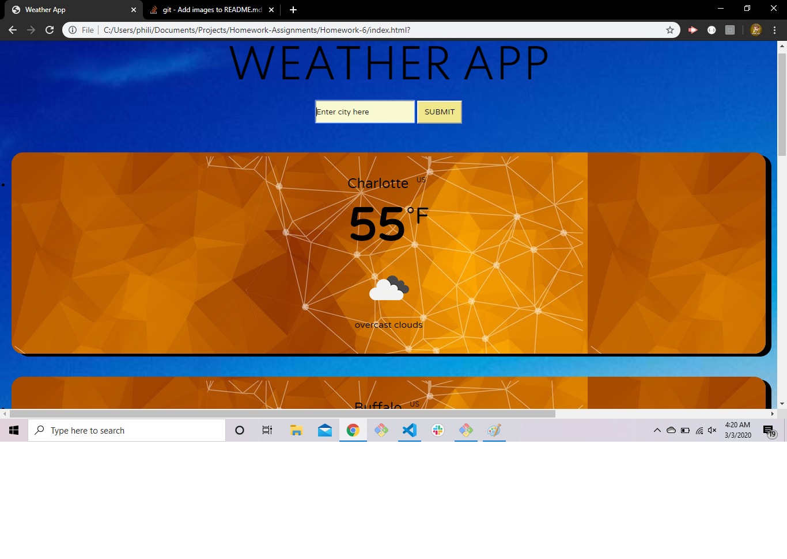

# Homework-6
This homework assignment involved similar skillsets as the last homework (day planner). Both assignments involve dynamically changing and adding content and styling based on an API. In this case, the openweatherapi was used to grab information about the weather about the user's requested input cities.
I was able to create a simple but effective layout that generates cards based on the current weather of the input city given. These cards are formatted as entire rows on desktop screens, but are dynamically added as smaller cards for tablet and mobile devices. 
The program also returns a rejection message upon receiving a user input that does not match any city name in the openweatherapi database.

